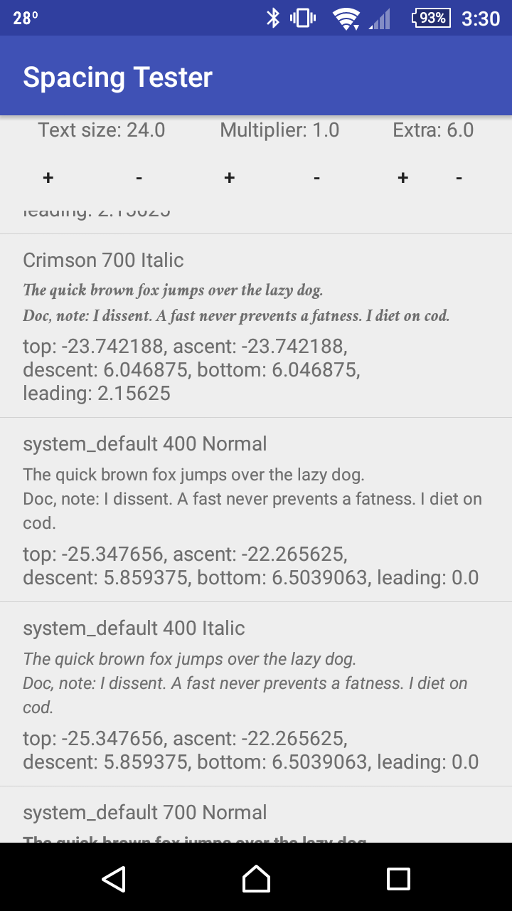

Android Linespacing Tester
==========================

This is a simple utility to allow you to experiment with the
[line spacing] settings on Android.

Font loading is controlled by [Fontain]. To add additional fonts, just
put them in additional subdirectories of `app/src/main/assets/fonts/`
and recompile the app with `./gradlew installDebug`

This app currently requires Android 5.0 or newer, though it would
probably not be terribly difficult to change this if it's important to
you to do so.

This app currently includes a copy of [Crimson Text], which is
distributed subject to the terms of the [SIL Open Font License][OFL].

[line spacing]: https://developer.android.com/reference/android/widget/TextView.html#setLineSpacing%28float,%20float%29
[Fontain]: https://github.com/scopely/fontain
[Crimson Text]: https://github.com/skosch/Crimson
[OFL]: http://scripts.sil.org/OFL
